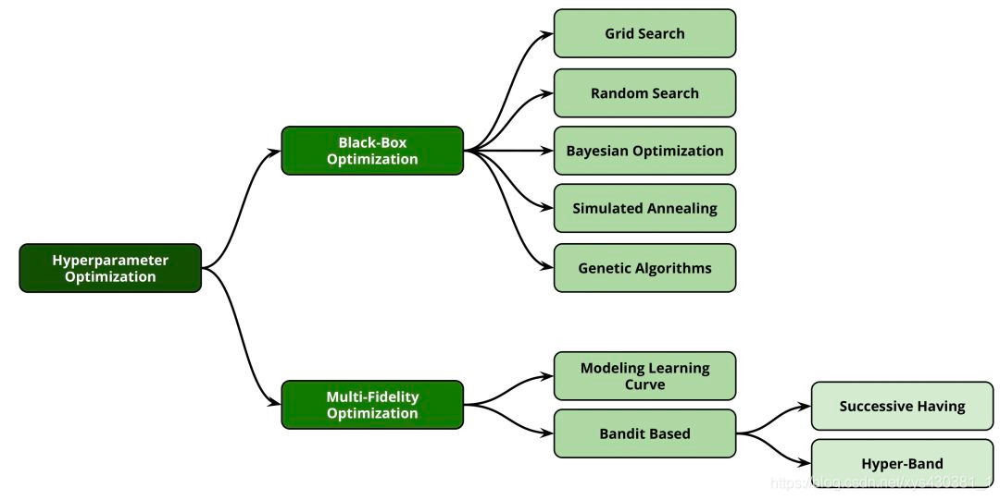
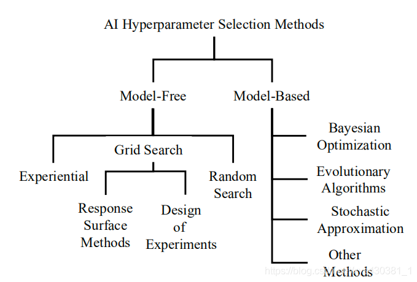
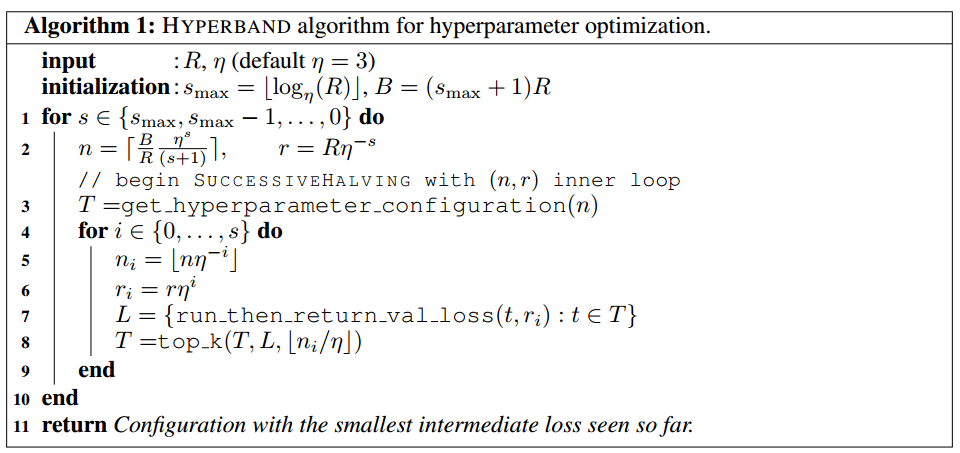

# AutoML:

automl-超参数优化（HPO）-综述
https://blog.csdn.net/xys430381_1/article/details/104856902

超参数优化方法分类

## 贝叶斯优化（Bayesian Optimization）
贝叶斯优化假设超参和目标函数存在一个函数关系。基于已搜索超参的评估值，通过高斯过程回归来估计其他搜索点处目标函数值的均值和方差。根据均值和方差构造采集函数（Acquisition Function），下一个搜索点为采集函数的极大值点。相比网格搜索，贝叶斯优化会利用之前的评估结果，从而降低迭代次数、缩短搜索时间；缺点是不容易找到全局最优解。

## 多保真优化--Multi Fidelity Optimization
在自动机器学习(Automatic Machine Learning, AutoML)任务中评价往往通过 k 折交叉验证获得，在大数据集的机器学习任务上，获得一个评价的时间代价巨大。这也影响了优化算法在自动机器学习问题上的效果。所以一些减少评价代价的方法被提出来，其中多保真度优化(Multi-Fidelity Optimization)[1]就是其中的一种。而多臂老虎机算法(Multi-armed Bandit Algorithm, MBA)是多保真度算法的一种。在此基础上，有两种主流的bandit-based优化策略：

在贝叶斯方法中，目标函数的估计非常昂贵。 有没有更便宜的方法来估计目标函数？ 多保真优化方法就是答案。 我会告诉你：

1. Successive Halving (SH) 连续减半
2. Hyperband (HB)
3. BOHB

### Hyperband算法

假设一开始候选的超参数组合数量是𝑛，那么分配到每个超参数组的预算就是𝐵/𝑛。所以Hyperband做的事情就是在𝑛与𝐵/𝑛做权衡(tradeoff)。
上面这句话什么意思呢？也就是说如果我们希望候选的超参数越多越好，因为这样能够包含最优超参数的可能性也就越大，但是此时分配到每个超参数组的预算也就越少，那么找到最优超参数的可能性就降低了。反之亦然。所以Hyperband要做的事情就是预设尽可能多的超参数组合数量，并且每组超参数所分配的预算也尽可能的多，从而确保尽可能地找到最优超参数。

Hyperband算法对 Jamieson & Talwlkar(2015)提出的SuccessiveHalving算法做了扩展。所以首先介绍一下SuccessiveHalving算法是什么。
其实仔细分析SuccessiveHalving算法的名字你就能大致猜出它的方法了：假设有𝑛组超参数组合，然后对这𝑛组超参数均匀地分配预算并进行验证评估，根据验证结果淘汰一半表现差的超参数组，然后重复迭代上述过程直到找到最终的一个最优超参数组合。
基于这个算法思路，如下是Hyperband算法步骤：

r: 单个超参数组合实际所能分配的预算；
R: 单个超参数组合所能分配的最大预算；
𝑠𝑚𝑎𝑥: 用来控制总预算的大小。上面算法中𝑠𝑚𝑎𝑥=⌊𝑙𝑜𝑔𝜂(𝑅)⌋,当然也可以定义为𝑠𝑚𝑎𝑥=⌊𝑙𝑜𝑔𝜂(𝑛𝑚𝑎𝑥)⌋
B: 总共的预算,𝐵=(𝑠𝑚𝑎𝑥+1)𝑅
𝜂: 用于控制每次迭代后淘汰参数设置的比例
get_hyperparameter_configuration(n):采样得到n组不同的超参数设置
run_then_return_val_loss(t,ri):根据指定的参数设置和预算计算valid loss。𝐿表示在预算为𝑟𝑖的情况下各个超参数设置的验证误差
top_k(𝑇,𝐿,⌊𝑛𝑖𝜂⌋):第三个参数表示需要选择top k(𝑘=𝑛𝑖𝜂⌋)参数设置。

### ASHA
https://blog.csdn.net/cansaizheng/article/details/116198497

ASHA就是Synchronous的SuccessiveHalving算法。异步后SHA就更容易并行。Hyperband的内循环就是SHA，外循环之间没有依赖可以简单的并行/异步化，所以Hyperband也可以对应的异步化为AsyncHyperBand。
在SHA中，在每次评估并终止一部分任务进入下一轮前，要等到本轮的所有任务都跑完。
假设我们在跑需要gpu的任务，有8块卡，刚开始每块卡上一个任务，进入第二轮后，只有4个任务了，我们不可能说让每两块卡跑一个任务，就能加速2x，到最后一轮，就有一个任务了，我们希望用8块卡跑能加速8x，这个加速比是很低的，计算资源浪费严重。不如此时再跑一些前边轮的任务，把资源都利用其起来。
ASHA就是说，我不再限制所有的处理器/显卡都同时跑同一轮次的任务，而是可以跑不同轮次的任务，所以称之为异步SHA。那么如果现在空出来一张显卡，应该给哪个任务用呢？
get_job()函数就是决定下一个跑什么任务。首先我们定义promatable任务。就是说这个任务的表现已经达到了目前轮次已经结束的任务的前1 / η 1/\eta1/η（在同步SHA中，需要等到所有的任务在本轮训练结束，再比较哪些达到所有任务的前1 / η 1/\eta1/η），而且这个任务还没跑下一轮次，那么这个任务就被成为promatable（可以进入下一轮次）。
get_job()函数在所有promatable任务中选出目前轮次最大的任务分配到空闲显卡上进入下一轮训练（因为越往后的轮次需要跑的时间越长，所以先分配到处理器上），如果现在没有promatable的任务可进入下一轮，那么就来一个第0轮的新任务分配到空闲显卡上来计算。
很明显，这样的好处就是可以更充分的利用计算资源。相同的时间能比同步算法跑更多的测试任务。

### PBT
PBT是一种类似遗传算法的参数优化方法。
假设我们有模型参数θ \thetaθ和训练过程中的超参数h hh，想要选择最好的超参数得到最好的训练结果。
PBT同时训练一堆网络，每个网络用不同的超参数训练，然后每个网络每训练一段时间（比如一个epoch），就评估一下当前网络的表现并记录，然后做一步exploit和一步explore。
exploit中，用这一堆网络中表现最好的网络的权重来替代当前网络的权重。（是否也用最好的网络的超参数替代当前网络的超参数视具体问题而定）。
explore中，对当前网络的超参数做一步随机的扰动。
exploit和explore后，接着训练这个网络，直到下一次评估、exploit和explore。

所有的网络就这样互相抄袭最好的权重，并扰动超参数直到训练结束。并不像ASHA会早停部分网络。
而且容易看出，PBT中能扰动的超参数必须是不影响深究给你网络结构的超参数。例如学习率、batchsize、dropout等都没问题，但是如果是layerwidth等，就不能用PBT了，因为不同网络权重都不相同，无法互相抄袭。

## Ray Trial Schedulers
https://docs.ray.io/en/latest/tune/api_docs/schedulers.html

## FLAML + Ray Tune
https://www.anyscale.com/blog/fast-automl-with-flaml-ray-tune

BlendSearch further combines this local search strategy used in CFO with global search. It leverages the frugality of CFO and the space exploration capability of global search methods such as Bayesian optimization. Specifically, BlendSearch maintains one global search model, and gradually creates local search threads over time based on the hyperparameter configurations proposed by the global model. It further prioritizes the global search thread and multiple local search threads depending on their real-time performance and cost. It can further improve the efficiency of CFO in tasks with complicated search space, e.g., a search space that contains multiple disjoint, non-continuous subspaces.

You can either use Ray Tune in FLAML or run the hyperparameter search methods from FLAML in Ray Tune to parallelize your search. 

blended search strategy which combines global search and local search strategy such that we can enjoy benefits from both worlds: (1) global search can ensure the con- vergence to the global optima when the budget is sufficient; and (2) local search methods enable a better control on the cost incurred along the search trajectory. 

The pool starts with one global search thread and gradually adds local search threads as the search goes on. Here a search thread is an instance of a global search or local search method, each with its own search trajectory. At each round, a search thread selector selects one of the search threads from the pool according to a priority metric that reflects the search threads’ current performance and efficiency of performance improvement. 

