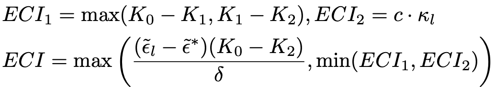
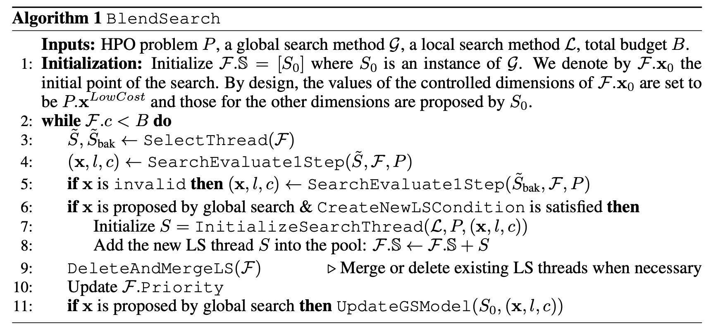

# FLAML 算法思想:

## FLAML 及 ECI 思想介绍
论文：[FLAML: A FAST AND LIGHTWEIGHT AUTOML LIBRARY](https://arxiv.org/abs/1911.04706) \
目的：如何用低计算成本来自动选择学习器和超参数
通过考察多种因素对调参试验成本和模型误差的联合影响，提出一些关于搜索算法设计的指导原则。

一次试验的成本由以下变量共同决定：学习器的选择、所选学习器的超参数子集、训练数据的大小和重采样策略。这些变量也会共同影响试验误差（即评估的模型误差）。
对于一个AutoML算法，如果只考虑低实验误差，则有可能导致高计算代价，反之，追求低计算代价，又可能导致高误差。一个好的AutoML能较好的平衡这两者。

FLAML 利用搜索空间的结构来选择针对成本和误差优化的搜索顺序。通过迭代的方式确定学习器、超参数、样本大小和重采样策略，在搜索的过程中同时考虑上述参数对成本和误差的综合影响。
搜索过程倾向于逐渐从低成本实验和不准确的模型转向高成本的试验和准确模型。

基于超参数和样本大小对误差的综合影响，给出以下性质：

> Property 1 (SuitableSampleSize)
合适的样本大小：小样本量可用于训练和比较低复杂度配置，而需要大样本量来比较高复杂度配置。

> Property 2 (Resample)
重采样：对于小样本量和大的时间预算，交叉验证优于holdout

> Property 3 (FairChance) 
机会公平：每个学习器都要有公平的机会被重新选择到

> Property4(OptimalTrial) 
最优实验：对于能实现的最低误差，任何搜索序列的总成本都期望是近似最优（即，与最优成本的比率有界）。

### 设计概览（Design Overview）

 

图 1 Major components in FLAML 

设计上共包含两层： ML层 和 AutoML层，ML层包含备选的学习器，AutoML层包含学习器推荐器，超参数和样本量推荐器，重采样策略推荐器和一个控制器。
控制流共分4个步骤，并通过序号按顺序标出。
步骤 0-2 负责在每个组件中选择相应的变量。
在步骤 3 中，控制器将使用 ML 层中选定的学习器进行试验，并观察相应的验证误差 ε ̃ 和成本 κ。
迭代重复步骤 1-3，直到用完预算。
在并行环境中，如果有可用资源，控制器可以在当前的迭代完成之前对步骤 1-3 开起新的迭代。
更改每个组件内的一种策略不会影响其他组件的策略。这种设计允许通过结合新的搜索方案来替换每个组件从而轻松升级。

搜索变量和搜索策略的分解
{l} → {h, s}
ECI-based sampling of learner choices → Randomized direct search, ECI-based choice of sample size
基于ECI的学习器选择 → 随机方向搜索，基于ECI的样本量选择。

### 搜索策略（Search Strategy）
首先介绍 estimated cost for improvement (ECI) 

先给出如下定义：

> ECI1:  (ECI1(l) 的缩写)，为学习器 l 在当前样本量下找到的误差低于当前最佳误差（表示为 ε ̃l ）的参数配置所需成本的估计。\
> ECI2:  学习器 l 在当前配置（花费 κl 成本）下，增加样本量（乘以系数 c）后的成本估计。\
> ECI:   对学习器 l 找到误差低于所有学习器中当前最佳误差（表示为 ε ̃* ）的参数配置所需成本的估计。\

> K0: （K0(l) 的缩写）为到目前为止花费在 l 上的总成本。 \
> 令 K1 > K2 为在l上最近两次最佳参数配置更新时分别花费的总成本。 \
> δ: （δ(l) 的缩写）是两个相应最佳配置之间的误差减少量。\

### ECI 计算公式：

> ECI1 = max(K0 − K1, K1 − K2), ECI2 = c·κl \
> ECI = max( (ε ̃l − ε ̃*) (K0 − K2) / δ, min(ECI1, ECI2) )

ECI1 的计算是基于这样的假设，即越是后面的搜索，发现改进需要付出的代价越高。\
ECI2 设置为 l 的当前参数配置的试验成本的 c 倍，因为我们期望当前配置的误差在给定 c 倍样本时得到改善。当样本量相关的训练过程的复杂性已知时，可以改进这种简单的成本估算。\
ECI 的计算取决于学习器 l 当前是否在所有学习器中具有最低的误差。\
(a) l 当前在所有学习器中具有最低的误差，此时 ECI = min(ECI1, ECI2) \
(b) l 当前在所有学习器中没有得到最低的误差，此时，距离最优误差还存在 ε ̃l − ε ̃* 的差距。 由上面的定义，误差提升 δ 需要的时间(上限)是 K0 − K2，可以得出学习器 l 在它的搜索空间中的误差提升速率为 
> v =  δ / (K0 − K2)
> 
所以，若提升 ε ̃l − ε ̃* 的误差，需要的时间估计是 
> (ε ̃l − ε ̃*)/v，即，(ε ̃l − ε ̃*) (K0 − K2) / δ

综合上面两个场景，就可以得到 ECI 的计算公式 \
 

下面给出一个图示示例 \
 \
图 2 基于 ECI 的优先级排序图示 

当前时刻是35s，为了说明 ECI 是可自调节的，我们添加了一个假设的 XGBoost 新试验（38 秒处的虚线三角形标记），但没有找到更好的模型。 
在这种情况下，ECI(xgb) 将增加，如水平橙色箭头所示，XGBoost 的优先级将降低。\
底部的图可视化了每个学习者的搜索轨迹。

下面再介绍下设计概要图（图1）中每一步的具体实现方法：

> Step 0: 重采样策略推荐器选择 r \
> 重采样策略基于一个简单的阈值规则进行决策。它是遵循 Property 2（重采样）的最简单设计。
> 如果训练数据集的实例少于 100K，并且 #instances × #features/budget 小于 10M/hour，我们使用交叉验证。否则，我们使用 holdout。
> 这个简单的阈值规则可以很容易地换成更复杂的规则，如元学习。默认情况下，FLAML 使用 5 折交叉验证和 0.1 作为保留率。

> Step 1: 学习器推荐器选择 l \
> 引入 ECI 的概念后，可以这样设计搜索策略，让每个学习器 l 以正比于 1/ECI(l) 的概率被选择。
> ECI 方法之所以是有效的有几个原因：
> (1）这个设计遵循属性 3 和 4。属性 4（OptimalTrial）建议优先选择能使用小预期成本改善误差的选项。因此，我们将给 ECI 较低的选项分配较高的概率。
> (2) 使用随机化的方式对学习器进行选择，而不是直接选择 ECI 最低的学习器，因为属性 3（机会公平）要求每个学习者都有机会被再次搜索， 并且我们对ECI的估计并不精准。
> (3) 随着更多 l 的观察数据被收集，ECI 将动态更新。 这会产生一种自我纠正行为：如果ECI 被高估了，它就会降低； 如果被低估，它会增加。

> Step 2: 超参数和样本量推荐器选择 h和s \
> 对超参搜索，采用随机方向搜索方法（CFO），该方法可以对成本相关的超参数进行成本效益优化。
> 该算法使用低成本参数配置作为起点。 在每次迭代中，它在 (|h| − 1) 维单位球体中采样随机方向 u，然后根据观察到的反馈决定是否沿该随机采样方向（或相反方向）移动到新的 h 以更改验证误差。
> 这样，下一次试验的成本可以通过相对于当前学习器的最佳配置的成本设定上限。试验成本的上限由所使用的搜索流程保证，并且只有在最优误差减少时才会逐渐增加。
> 搜索步长会被自适应的调整（开始时较大以快速接近所需的复杂度）并且会适时重启搜索（从随机初始点）以避免陷入局部最优。
> 
> 尽管随机方向搜索并不处理子采样，但在我们的框架中使用它则是一个不错的选择，得益于下面的两个重要原因。
> (1) 该方法从理论上和实证上证明了其在控制试验成本方面的有效性。 该方法的理论分析表明它与属性 4 (OptimalTrial) 一致，其实证研究表明优于贝叶斯优化方法。
> (2) 该方法不需要每次试验的确切验证误差作为反馈，只要可以确定任意两次试验的相对顺序，我们就可以利用它来做数据子采样。
> 
> 为了适应数据子采样，进行了几项重要调整。 
> 从每个 l 的小样本量 (10K) 开始。 对于每个请求的 l，我们首先通过比较 ECI1(l) 和 ECI2(l)，在增加样本大小和尝试使用当前样本大小的新配置之间做出选择。 
> 当 ECI1(l) ≥ ECI2(l) 时，保持当前的超参数值并增加样本量。 否则，我们保持当前样本大小，并使用上述随机方向搜索方法生成新的超参数值。
> 
> 通过这种设计，系统将根据需要自适应地更改样本大小。 一旦学习器的样本大小达到完整数据大小，它就会继续使用该大小，直到该学习器收敛。 
> 与多保真裁剪相比，这降低了通过小样本裁剪掉好配置的风险。 当对该学习器的搜索重新开始时，样本大小也将重置为初始值。

> Advantages: 
> 首先，我们的搜索策略旨在为临时数据集（ad-hoc datasets）提供强大的最终性能（final performance）（即低最终错误），这需要大的搜索空间。第 1 步中根据 ECI 进行的随机采样和第 2 步中的随机重启有助于该方法逃避局部最优。
> 
> 其次，我们的搜索策略旨在为临时数据集提供强大的全时性能（anytime performance）。步骤 1 中基于 ECI 的优先级排序在开始时有利于廉价学习器，但如果误差改进缓慢，则稍后会对他们进行惩罚。
> 步骤 2 中的超参数和样本量推荐器倾向于在搜索的开始阶段提出廉价的配置，但在搜索的后期会根据需要迅速转移到模型复杂度高和样本量大的配置。
> 
> 这些设计使 FLAML 无论对小数据集还是大数据集都能有效地指导大型搜索空间的搜索。
> 最后，与 ML 层中的试验成本相比，AutoML 层中的计算开销在我们的解决方案中可以忽略不计：基于 ECI 的采样、随机方向搜索和 ECI 更新。每次迭代的这些操作的复杂性与超参数的维数成线性关系，并且不依赖于试验次数。

## CFO（Cost Frugal Optimization）算法：关于成本相关超参数的资源节约优化方法
论文：[Frugal Optimization for Cost-related Hyperparameters](https://arxiv.org/abs/2005.01571) 

目的：如何以低成本解决HPO问题。
HPO相关工作分析：
很多机器学习算法的不同超参数会对训练成本影响很大，现有的超参优化（hyperparameter optimization, HPO）算法主要关注超参数对模型准确性的影响而在很大程度上忽略了超参取值对训练成本的影响，因此，这些方法无法在优化过程中对成本进行有效控制。\
HPO 通常被认为是一个黑盒函数优化问题，其中评估黑盒函数是昂贵的，因为训练和验证模型可能非常耗时。\
Bayesian optimization (BO)：使用概率模型近似黑盒函数进行优化。然而，经典的基于BO的方法主要是为了最小化函数总评估次数而设计的，这并不一定会带来低评估成本。 \
多保真方法（multi-fidelity）: 近期的一些工作研究了使用多保真优化来控制HPO成本的方法。FABOLAS 引入数据集大小作为贝叶斯优化中的额外自由度。 Hyperband 和 BOHB 尝试通过在搜索过程中分配逐渐增加的“预算”来降低成本。预算的概念可以对应于样本大小或迭代训练算法的迭代次数。
这些解决方案假设每个固定“预算”的评估成本相等或相似，但当存在与成本相关的超参数时，这样的假设就不一定满足了。\
Gaussian process with expected improvement per second (GPEIPS) ：该方法是现有的通用成本相关超参数方法，它使用另一个高斯过程对评估成本进行建模，并启发式地将估计成本添加到采集函数中。 尽管这种方法适用于通用的与成本相关的超参数，但在对损失或成本的优化上都没有理论上的保证。

为了解决上述问题，这里提出了一种新的成本节约型HPO方法，随机方向搜索（randomized direct search）方法。
该方案通过减少收敛前的迭代次数，并限制每次迭代成本，从而使总评估成本较低。
CFO建立在随机方向搜索方法FLOW2之上，在最小化损失时可以有一个近似最优的总成本。

FLOW2 \
 \
FLOW2 算法

FLOW2 从低成本区域开始，逐渐向低损失区域移动，避免对高成本和高损失超参数进行评估。 该算法要求提供一个低成本初始点，利用参数配置与其相应成本及损失之间的关系进行迭代搜索。
FLOW2 有一些非常好的属性，包括对迭代次数的有界性限制以及对每次迭代成本的有界性限制，这使 FLOW2 具有成本经济性。 现有的随机搜索方法无法对总成本做有界性限制。
如何在不影响损失收敛的情况下有效地将观察成本或估计成本信息纳入搜索过程是非常重要的。
FLOW2算法利用了成本函数的一些属性，当 FLOW2 的特定更新规则与这些属性相结合时，它可以将搜索限制在原始搜索空间的子空间中，避免搜索不必要地高成本的点，从而不会违反其收敛速度。

FLOW2为了节约成本而设计的更新规则：
令 x^best_k 表示在 FLOW2 的第 k 次迭代中到目前为止找到的最佳配置（即损失最低）。
因为在每次迭代中 FLOW2 首先检查建议的新点 xk ± δuk 是否可以在将 xk+1 更新为 xk ± δuk 或 xk 之前降低损失。它保证在任何迭代 k，都有如下性质：
> (Property 1) xk = x^best_k 总是成立； \
> (Property 2) 下一个配置 xk+1 总是在 xk 的邻域内; \
> (Property 3) 除初始化step外，新配置的评估仅在算法 1 的第 5 行或第 6 行中调用，对应于最多 g(xk + δuk) + g(xk − δuk) 的成本；\
属性 1 和属性 2 可以帮助我们确定新配置的成本 g(xk+1) 与当前最佳点 g(xbest) 的成本之间差异的界限。
如果起点 x0 是在低成本域初始化，可以进一步证明 g(xk+1) 不会比 g(x∗) 大太多。 将上述结论与性质 3 结合起来，限制了 FLOW2 每次迭代所产生的成本。 然后通过收敛性保证，最终可以约束 FLOW2 中产生的总成本。

与现有算法的比较：
HPO 中常用的贝叶斯优化方法不能保证前面介绍的性质 2 和 3，因此对总成本很难有理论上的保证。

FLOW2 收敛性分析（略）

FLOW2 代价分析

> Condition 2 (代价函数 g(x) 的 Lipschitz 连续性). ∀ x1,x2 ∈ X, |g(x1) − g(x2)| ≤ U × z(x1 − x2),  U 是 Lipschitz 常数, z(x1 − x2) 是关于 x1 − x2 的特定距离函数。 例如 z(·) 可以是 代价相关的 Euclidean 范数。\
> Condition 3 (代价和损失之间的局部单调性). ∀ x1,x2 ∈X,如果 2D+g(x ̃∗)≥g(x1)>g(x2)≥g(x ̃∗),则 f(x1) ≥ f(x2). \
条件 3 指出当成本超过局部最优点 x ̃* 的成本时，即 g(x) ≥ g(x ̃*)，随着局部范围内评估成本的增加，损失不会减少.

> Proposition 2 (FLOW2 中成本变化的界). 如果条件 2 成立, 则 g(xk+1) ≤ g(xk) + D, ∀k. \
> Proposition 3 (FLOW2 中函数评估成本的界). 在条件 2 和 3下, 如果 g(x0) < g(x ̃∗), 则 g(xk) ≤ g(x ̃∗) + D, ∀k. \
命题 3 断言每次评估的成本总是在离局部最优点评估成本的常数范围内。进一步理解为 FLOW2 只会在验证损失减少时移动，因此一旦搜索过程进入条件 3 中定义的局部单调区域，搜索代价将不会比局部最优点的评估成本更多。\

通过对FLOW2进行实用性调整我们得到CFO算法：

尽管理论上保证了其良好的收敛速度和预期的总成本，但因为仍存在如下问题使得算法 1 中提出的普通 FLOW2 并不适用于 HPO 问题。
>(1) 陷入局部最优的可能性； \
>(2) 需要步长作为FLOW2的超参数；\
>(3) 离散超参数的存在。\
这些限制可以使用优化中常用的技术有效地解决。通过采用下面列出的调整方式，我们将 FLOW2 变成一个有效的 HPO 解决方案，命名为 CFO（Cost-Frugal Optimization）并在算法 2 中给出。\

> FLOW2 的随机重启。\
与大多数局部搜索算法类似，FLOW2 可能会陷入局部最优。常见解决方案是在观察不到任何改进时重启算法。因此在没有改进的情况下，从一个随机的起点重启 CFO。“无改进”信号由连续无改善的次数和 stepsize 的值决定。随机起始点是通过在原初始点 x0 上添加高斯噪声 g 生成。

> 动态调整步长δ。\
为了达成之前证明的收敛速度，FLOW2 的步长 δ 需要设置为与 1/√K∗ 成正比的常数，这很难事先确定，因此自适应步长在迭代优化和搜索算法中是很普遍的方法。
我们提出的自适应步长规则为：初始化步长为δinit=√d。当连续无改进的迭代次数大于2^(d−1)时则减小步长。
具体来说，δ 被贴现乘以 1/√η，其中缩减比率 η > 1 表示为自上次重启以来的迭代总数与自上次重启以来寻找到最佳配置的迭代总数之间的比率。这样，步长缩减比率 η 不需要预先指定，而是可以根据搜索的进展自行调整。
通过给δ 设置一个下限 δlower，当达到该下限时则停止减小，从而避免δ 变得到过小。这也被设计成自适应调节机制。

> 推荐配置的投影。新提出的配置 x ± u 不一定在可行的超参数空间 X 中，尤其是当存在离散超参数时。在这种情况下，我们使用投影函数 ProjX (·) 将其映射到可行空间 X 。

 

CFO 算法

## Blend Search
论文：[ECONOMICAL HYPERPARAMETER OPTIMIZATION WITH BLENDED SEARCH STRATEGY](https://openreview.net/pdf?id=VbLH04pRA3) 

通过研究如何在具有异构评估成本和模型质量的大型搜索空间中低成本搜索超参数配置的问题。 提出了一种混合搜索策略，以结合全局和局部搜索的优点，并在运行中对它们进行优先级排序，目标是使寻找最优配置所花费的总成本最小。

BlendSearch 进一步将 CFO 中使用的本地搜索策略与全局搜索相结合。 它利用了 CFO 的经济性和贝叶斯优化等全局搜索方法的空间探索能力。 具体来说，BlendSearch 维护一个全局搜索模型，并根据全局模型提出的超参数配置随时间逐渐创建局部搜索线程。 
进一步根据实时性能和成本对全局搜索线程和多个本地搜索线程进行优先级排序。 它可以进一步提高 CFO 在具有复杂搜索空间的任务中的效率，例如，包含多个不相交的、不连续的子空间的搜索空间。

已经有多种方法尝试从不同的角度解决 HPO 的效率问题。 这些方法都各有其优点和局限性。 例如，贝叶斯优化 (BO) 是一类全局优化算法，用于最小化总迭代次数以达到全局最优。 然而，当不同超参数配置的成本不同时，BO 可能会选择不必要的高成本的配置。 \
与 BO 不同，局部搜索 (LS) 方法能够通过避免非常昂贵的试验来控制总成本，但它们可能会陷入局部最优。 多保真方法旨在使用廉价的代理来替代一些昂贵的试验并近似评估准确性，但只能在存在此类代理时使用。 单一的搜索策略难以满足经济型 HPO 的通用目标。

混合搜索（blended search）策略结合了全局搜索和局部搜索策略，这样就可以同时利用两者的优点：\
(1) 全局搜索可以确保在预算充足时收敛到全局最优； \
(2) 局部搜索方法可以更好地控制沿搜索轨迹产生的成本。 \
BlendSearch 搜索框架根据以下设计原则组合给定的全局和局部搜索方法。\
(1) 同时考虑两种候选搜索方法，并决定在每一轮配置选择中使用哪一种。 \
(2) 使用全局搜索方法来确定局部搜索线程的起点。 \
(3) 使用局部搜索方法来指导全局搜索方法的配置选择，以避免可能产生不必要的过大评估成本的配置。 \
(4) 根据两种方法的性能和性能改进效率对两种方法的搜索实例进行优先级排序。

首先简要介绍vanilla Bayesian 优化方法和局部搜索方法（我们的blended search方法的组成部分）。 \
贝叶斯优化是一类适用于优化高成本黑盒函数的全局优化算法。 它以优化变量为条件对目标的概率分布进行建模。 典型模型包括高斯过程、随机森林和 tree Parzen 估计器 (TPE) 。\
在 BO 方法中，采集函数用于确定下一个要评估的点。 两个常见的采集函数是 expected improvement (EI) ，超过当前最佳观察目标和置信上限 (UCB)。\
局部搜索方法在一般优化文献中很普遍，但由于可能陷入局部最优，因此在 HPO 文献中研究较少. 最近的工作表明，局部搜索方法 FLOW2 与低成本初始化和随机重启相结合可以提升 HPO 的成本效益。\
在每次迭代中，它从单位球面上随机均匀地采样一对向量（具有相反的方向），其中心是到目前为止找到的最佳配置（也称为现任），其半径是当前步长。 
一开始就避免了高成本的配置，因为每次迭代都会提出一个接近现任的配置。 一旦满足收敛条件，就会随机重启局部搜索。

有几种方法尝试解决普通 BO 或本地搜索方法的局限性。 BOwLS (BO with local search) 使用 BO 模型来选择本地搜索线程的起点。 每个本地搜索线程一直运行直到收敛，并且 BO 模型使用起点和收敛损失进行更新。
信任域 BO 拟合固定数量的局部模型，并通过隐式赌博机方法在这些模型中执行全局样本分配。 它主要用于具有高维数值超参数的 HPO 问题。
不幸的是，所有试图将全局搜索与局部搜索方法结合起来的现有工作都没有考虑随着搜索而产生的评估成本的异质性。
多保真度优化通过加速对参数配置的评估来提高 HPO 效率。 他们通常需要称为“保真度”额外的自由度，以允许对具有不同保真度的配置进行性能评估。
对于通用的具有成本效益的 HPO，之前的工作则较少。 每秒预期改进的高斯过程 (GPEIPS)使用另一个高斯过程对评估成本进行建模，并启发式地将估计成本添加到采集函数中。 它并不总是优于 GPEI，因为采集功能会过度惩罚表现良好但成本高的配置。

### blended search 算法
输入信息：

> - B 是成本的总预算。 在这项工作中，我们通过 CPU/GPU 时间来衡量成本。
> - P 是输入 HPO 问题，具有以下表征问题的属性。
> - -  P.X 是搜索空间，其中每个元素 x 是一个 d 维超参数配置。 对于一个非分类超参数坐标 i ∈ [d]，如果 xi 的不同值导致异构成本，并且存在一个已知值 P.xLowCost 对应于一个低成本配置，它被认为是一个受控维度，使用 P.D 来表示这样一组受控维度。
> - - P.LossFunc(·) 是要根据配置 x ∈ P.X 最小化的损失函数。
> - - P.CostFunc(·) 是评估 x 时的成本函数。
>> HPO 算法的目标是最小化损失 P.LossFunc(x)，约束条件是总成本 G(π) := Sum P.CostFunc(x) ≤ B，x∈T(π)，其中 T(π) 为算法 π 的搜索轨迹。 注意，P.LossFunc(x) 和 P.CostFunc(x) 都是黑盒函数，即没有通常的解析形式，只能使用观察到的函数值。
> 为了区分损失/成本函数的查询操作和观察值，我们用P.LossFunc(x)和P.CostFunc(x)来表示前者，并用l(x)和c(x) 来表示后者。 当没有歧义时使用 l 和 c。
> - G 是全局搜索方法。 L 局部搜索方法。 L.∆ 是局部搜索方法 L 中使用的最大步长，即两个连续搜索步骤之间超参数值的最大可能变化。 \

 BlendSearch 框架 \
“Config Evaluator”的两条路径独立执行

我们框架的总体设计如图（BlendSearch框架）和 BlendSearch算法 所示。关键思想是维护一个搜索线程池，其中一个对应全局搜索，另一个对应局部搜索。
该线程池从一个全局搜索线程开始，并随着搜索的进行逐渐添加本地搜索线程。这里的搜索线程是全局搜索或局部搜索方法的实例，每个都有自己的搜索轨迹。 
在每一轮中，搜索线程选择器根据搜索线程当前性能和性能改进效率的优先级指标从池中选择一个搜索线程。然后，选定的搜索线程将用于推荐将在本轮中进行评估的配置。 
当所选的搜索线程是全局搜索线程时，参数配置验证器首先检查推荐的配置是否在要评估的可行域内，如果不是，则会使用备用的本地搜索线程。 
只有当全局搜索线程提出有效的配置并且满足创建线程的条件时才会创建本地搜索线程，一旦收敛就会删除本地线程。如果两个本地搜索线程足够接近，它们将合并为一个。每个搜索线程的优先级在每轮评估之后更新。

 

BlendSearch 算法 

为方便起见，我们使用 F 来表示框架级变量的集合：
> - F.S 是我们框架中维护的搜索线程列表。 F.S至少包含一个搜索线程，其中在F.S中只有一个全局搜索线程，即S0。
> - F.Priority是一个优先级字典，其中key为F.S中的搜索线程，value为对应搜索线程的优先级。
> - F 的簿记信息(Bookkeeping information)：F.l* 是所有搜索线程中实现的最佳损失，F.c 是我们框架中消耗的总成本。
> - F.R 是一个超矩形，是当前搜索的受控维度上的“可行域”，可以写成 F.R := {[F.xi_min,F.xi_max]}, i∈D 的形式，其中 F.xi_min, F.xi_max 分别表示 F.R 中第 i 个维度的最小值和最大值。 
> - - 对于所有 i ∈ D，它们最初设置为 F.xi_min = F.xi_max = P.xi_LowCost。“可行域”在搜索过程中逐渐扩展：
> (1) 它扩展到覆盖所有搜索线程评估的所有点 以及在一个搜索步骤中本地搜索可能到达的所有点，如算法 SearchEvaluate1Step 的第 7 行和第 8 行所示； 
> (2) 如果局部搜索线程收敛，则会进行扩展。

 

算法 SearchEvaluate1Step  

BlendSearch 算法中的关键步骤：

> Step 1: 搜索线程选择器（BlendSearch 算法 的第 3 行）。SelectThread 除了主搜索线程 S̃ 之外，还输出一个备份搜索线程 S̃bak，保证是本地搜索线程。当 F.S 中还没有本地搜索线程时，设置为 none。 \
> 优先级指标的设计遵循多臂老虎机问题的不确定性优化原则，以平衡利用和探索。
> 具体地，自适应地和局部地执行线性外推以计算每个搜索线程的改进速度。基于这种线性外推法估计的未来奖励提供了真实未来奖励的一阶上限，假设每个搜索线程的收益递减，即改进速度随着更多资源的消耗而降低。形式上，我们为每个搜索线程 S ∈ F.S 引入以下变量和函数。
> - 记账信息（Bookkeeping information）：S.l1st 和 S.l2nd 是迄今为止最佳损失和达到最佳损失之前的次佳损失。 S.c1st和S.c2nd分别是达到S.l1st和S.l2nd时的总成本。 S.c 是在 S 中花费的总成本。S.x1st 是目前发现的最佳配置。
> - S.s 为 S 的性能提升速度，计算公式为 S.s = (S.l2nd−S.l1st) /(S.c−S.c2nd) 。 此公式仅在至少有一次改进时才有效。 否则，我们没有足够的信息来估计改进的速度。 当 S.l2nd = S.l1st 时，我们将速度设置为所有搜索线程中的最高速度。 这是由于隐含的收益递减假设。
> - S.xmin 和 S.xmax 分别是在 S 中评估的所有超参数配置的第 i 个维度的最小值和最大值。
> - S.CostImp(·) 是一个函数，输入是目标损失，输出是 S 产生比该目标更好的损失的预期成本。 我们使用下面的公式来计算，直观地是使用过去的改进成本来估计未来成本。
> - - S.CostImp(l) = max{S.c − S.c1st, S.c1st-S.c2nd, 2(S.l1st-l)/S.s }
> 我们提出的优先级指标是 负的 S 的预估损失：
> - F.Priority(S) = −(S.l1st − S.s × b) 
> - 其中 b = min(maxS∈F.S S.CostImp(F.l∗), B − F.c). maxS∈F.S S.CostImp(F.l∗) 可以认为是每个 S 比当前最佳损失 F.l∗ 更好所需的资源。 
> 如果给定这样的资源（受预算剩余 B − F.c 的限制），我们的优先级指标会估计每个搜索线程的损失。 通过同时考虑搜索线程的当前性能和潜在改进，它在利用当前最佳和探索可能更好的选择之间做出公平权衡。

> Step 2: 配置验证器和评估器（算法 的第 4-5 行）。选择搜索线程（和备用搜索线程）后，下一步是建议下一个配置以尝试使用所选搜索线程。根据选择的优先级最高的搜索线程S来生成下一个待尝试的配置。但是为全局搜索线程设置了一个防护栏，因为它可能会提出不必要的高成本配置。 
> 因此，我们引入了一个配置验证器，根据全局搜索提出的配置是否在我们框架 F.R 的当前允许区域内（Alg 2 的第 3 行）来验证它们。 标记为“无效”的配置意味着它被认为容易产生不必要的高成本，因此不会在本轮评估。 在这种情况下，如果选定的备份搜索线程是有效的搜索线程（即不是None），则将使用它来执行另一轮 SearchEvaluate1Step（算法 1 的第 5 行）。 
> 在没有备份线程的情况下，我们根据 Alg 2 的第 1 行生成新配置。配置验证器有助于避免潜在的高成本评估，从而避免在必要时从高成本点创建本地搜索线程。它不会永远坚持本地搜索，因为可容许区域 F.R 得到了扩展。 请注意，根据 F.R 的定义，只有超参数配置的受控维度需要进行验证检查。 
> 如果需要，可以在此配置评估器组件中使用多保真度修剪策略。多保真度修剪不一定会产生更好的性能。因此，在 BlendSearch 中采用多保真度剪枝是可选的。
> 
> Step 3: 搜索线程创建器、更新器和清理器（算法的第 6-11 行）。 如果新提议的配置是由全局搜索提议的并且没有被标记为“无效”，我们会考虑使用提议的配置作为起点创建一个新的本地搜索线程。 
> 为了确保新创建的本地搜索线程相对较好，我们首先检查建议配置的性能是否优于现有线程性能的至少一半（在 CreateNewLSCondition 中指定）。 如果是，则初始化一个新的本地搜索线程，并添加到活动搜索线程池S中。
> 在DeleteAndMergeLS中，我们根据特定的本地搜索方法的收敛情况检查本地搜索线程是否已经收敛。如果是，则搜索线程将从 S 中删除。
> 此外，我们还遍历所有本地搜索线程，以查看 LS 线程的现任者是否可以通过另一个具有较低损失的 LS 线程一步到达。 如果是这样，之前的 LS 线程将被删除。 
> 在对全局搜索提出的配置进行评估后，观察元组 (x, l, c) 将用于通过函数 UpdateGSModel 更新全局搜索方法的模型。 例如，当全局搜索方法是贝叶斯优化方法时，模型是使用的代理模型。

## FLAML + Ray Tune

[Fast AutoML with FLAML + Ray Tune](https://www.anyscale.com/blog/fast-automl-with-flaml-ray-tune) 

FLAML 可以利用 Ray Tune 进行分布式超参数调优，以在集群中扩展 AutoML 方法。

如何使用 Ray Tune 的分布式调优扩展 CFO 和 BlendSearch

为了加速超参数优化，可能需要并行化超参数搜索。 例如，BlendSearch 能够在并行设置中很好地工作：它利用可以独立执行的多个搜索线程，而不会明显降低性能。 对于现有的优化算法（例如贝叶斯优化）而言，这种理想的性质并非总是成立的。

为了实现并行化，FLAML 集成了 Ray Tune。 Ray Tune 是一个 Python 库，它允许你在集群上利用前沿的优化算法，从而加速超参调优。 
